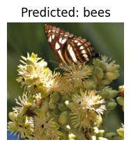

# Transfer Learning on Image Data: Classifying Images of Bees versus Ants

I used this [transfer leaning tutorial](https://pytorch.org/tutorials/beginner/transfer_learning_tutorial.html) to create model that classifies an image as an ants or a bee. 
We used "transfer knowledge" from the ImageNet task, which has 1000 classes and 1.2 million images, to the bees vs ants task because we do not have a dataset of sufficient size to train our model.

At the end, we gave our model a specific image to see how it classified it. The output is below:

